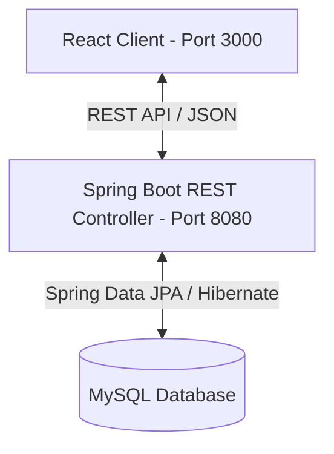

# 🚀 TeamFlow: Full-Stack Employee Management System

TeamFlow is a modern, enterprise-grade Full-Stack Employee Management System. It is designed to streamline organizational workflows, allowing administrators to manage workforce data efficiently. The platform features a responsive React-based user interface and a robust, high-performance Spring Boot REST API backed by a MySQL database.

---

## 🏗️ Architecture Overview

The system follows a decoupled Client-Server architecture:



- **Frontend (Client):** Single Page Application (SPA) built with React.js, utilizing Axios for asynchronous HTTP communications.
- **Backend (Server):** Spring Boot application providing RESTful API endpoints, utilizing JPA/Hibernate for Object-Relational Mapping (ORM).
- **Database:** MySQL database instance hosting relational schemas with structured constraints.

---

## 🛠️ Technology Stack

| Layer | Technology | Version | Purpose |
| :--- | :--- | :--- | :--- |
| **Frontend** | React.js | `16.13.1` | User Interface & SPA routing |
| | Bootstrap | `4.5.0` | Responsive layout & styling |
| | Axios | `0.19.2` | Promise-based HTTP client for API consumption |
| **Backend** | Spring Boot | `3.0.4` | Application Framework |
| | Java | `17` | Backend programming runtime |
| | Spring Data JPA | `3.0.4` | Simplified database access abstraction |
| | Hibernate | `6.1.7` | JPA Implementation (ORM) |
| **Database** | MySQL | `8.x` | Relational Database |

---

## 📂 Repository Structure

```directory
TeamFlow/
│
├── springboot-backend/           # Java Spring Boot REST API
│   ├── src/main/java/            # Application source code
│   │   └── net/javaguides/springboot/
│   │       ├── controller/       # RestController APIs
│   │       ├── exception/        # Custom resource exception handlers
│   │       ├── model/            # JPA entities
│   │       └── repository/       # Data JPA repository interfaces
│   ├── src/main/resources/       # Configuration (application.properties)
│   └── pom.xml                   # Maven dependencies and configuration
│
└── react-frontend/               # React SPA Frontend
    ├── src/
    │   ├── components/           # Reusable UI components
    │   ├── services/             # Axios API service integrations
    │   ├── App.js                # Core layout & React Router configuration
    │   └── index.js              # Application entrypoint
    └── package.json              # Node.js dependencies and script setups
```

---

## ⚙️ Quick Start & Setup

### Prerequisites
- **Java JDK 17**
- **Node.js (v18+)** & **npm**
- **MySQL Server**

### Step 1: Database Setup
1. Create a MySQL database instance:
   ```sql
   CREATE DATABASE employee_management_system;
   ```
2. Configure credentials in `springboot-backend/src/main/resources/application.properties`:
   ```properties
   spring.datasource.url=jdbc:mysql://localhost:3306/employee_management_system?useSSL=false&allowPublicKeyRetrieval=true
   spring.datasource.username=<your_username>
   spring.datasource.password=<your_password>
   ```

### Step 2: Spin Up the Spring Boot Backend
Navigate to the backend directory and execute:
```bash
cd springboot-backend
./mvnw spring-boot:run
```
The server will boot up on **`http://localhost:8080`**.

### Step 3: Run the React Frontend
Navigate to the frontend directory, install dependencies, and start the application:
```bash
cd react-frontend
npm install
npm start
```
The client application will start on **`http://localhost:3000`**.

---

## 📝 API endpoints documentation

All endpoint requests must be made to: `http://localhost:8080/api/v1`

| HTTP Method | Endpoint | Description | Request Body | Response Code |
| :--- | :--- | :--- | :--- | :--- |
| **GET** | `/employees` | Retrieve all employees | None | `200 OK` |
| **POST** | `/employees` | Create a new employee | Employee JSON | `200 OK` / `201 Created` |
| **GET** | `/employees/{id}` | Retrieve a specific employee by ID | None | `200 OK` / `404 Not Found` |
| **PUT** | `/employees/{id}` | Update details of an existing employee | Employee JSON | `200 OK` / `404 Not Found` |
| **DELETE** | `/employees/{id}` | Remove an employee record | None | `200 OK` / `404 Not Found` |

---

## 👤 Developer Profile & Tech Roles

This project exhibits competencies across several crucial technical roles:

*   **Backend Engineer (Java/Spring Boot):** Demonstrates command over Spring Framework core concepts, RESTful Web Service design, database abstraction with JPA/Hibernate, clean exception-handling patterns, and transaction management.
*   **Frontend Engineer (React.js):** Showcases structural composition of reusable components, unified state management, API service encapsulation with Axios, routing using React Router DOM, and environment-agnostic configuration support.
*   **Full-Stack Integrator:** Handles CORS validation protocols, request/response data mapping, environment configuration, database migration patterns, and local environment staging.
