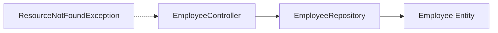

# ☕ TeamFlow Backend: Java Spring Boot REST API

This is the backend API engine for **TeamFlow**, a high-performance Employee Management System. Built using **Java 17** and the **Spring Boot 3** ecosystem, this server acts as the primary data orchestrator, exposing RESTful endpoints, implementing ORM mapping via Hibernate, and interacting securely with MySQL.

---

## 🛠️ Tech Stack & Architecture Details

-   **Spring Boot 3.0.4:** Utilizing Spring MVC for REST controllers, Spring Dependency Injection, and boot auto-configurations.
-   **Java 17:** Incorporating modern Java features, record types, and updated runtime support.
-   **Spring Data JPA:** Abstracting repository layers via standard interfaces, minimizing boilerplate SQL queries.
-   **Hibernate ORM 6.x:** Managing relational-to-object mappings and schema updates synchronously.
-   **MySQL Driver (Connector/J):** Managing low-level connection pooling and query transactions.

---

## 🏗️ Design Patterns & Code Architecture

The backend project is structured using clean architectural patterns:



### 1. Model / Entity Layer (`net.javaguides.springboot.model`)
Defined with JPA annotations (`@Entity`, `@Table`, `@Id`, `@Column`) to map directly to the `employees` table schema in the database.
-   `id`: Primary key with auto-increment configuration.
-   `firstName` / `lastName`: Maps to snake_case column names (`first_name`, `last_name`).
-   `emailId`: Unique email address columns.

### 2. Repository Layer (`net.javaguides.springboot.repository`)
Implements `JpaRepository<Employee, Long>`, enabling out-of-the-box CRUD interfaces without custom SQL writing.

### 3. Controller Layer (`net.javaguides.springboot.controller`)
-   Configured with `@RestController` and `@RequestMapping("/api/v1/")`.
-   Decorated with `@CrossOrigin(origins = "http://localhost:3000")` to allow seamless Cross-Origin Resource Sharing (CORS) with the React SPA.
-   Exposes REST endpoints adhering to HTTP method standards (`GET`, `POST`, `PUT`, `DELETE`).

### 4. Custom Exception Handling (`net.javaguides.springboot.exception`)
Includes a custom `ResourceNotFoundException` subclassing `RuntimeException` and decorated with `@ResponseStatus(value = HttpStatus.NOT_FOUND)` to automatically serialize clear error messages and accurate HTTP response codes back to the client when a database lookup fails.

---

## 🔌 API Reference & Data Contracts

### 1. Get All Employees
-   **Endpoint:** `GET /api/v1/employees`
-   **Status Code:** `200 OK`
-   **Response Body Sample:**
    ```json
    [
      {
        "id": 1,
        "firstName": "John",
        "lastName": "Doe",
        "emailId": "john.doe@example.com"
      }
    ]
    ```

### 2. Create Employee
-   **Endpoint:** `POST /api/v1/employees`
-   **Content-Type:** `application/json`
-   **Request Body Sample:**
    ```json
    {
      "firstName": "Jane",
      "lastName": "Smith",
      "emailId": "jane.smith@example.com"
    }
    ```
-   **Status Code:** `200 OK`

### 3. Get Employee By ID
-   **Endpoint:** `GET /api/v1/employees/{id}`
-   **Status Code:** `200 OK` / `404 Not Found` (if employee doesn't exist)

### 4. Update Employee
-   **Endpoint:** `PUT /api/v1/employees/{id}`
-   **Request Body Sample:**
    ```json
    {
      "firstName": "Jane",
      "lastName": "Doe",
      "emailId": "jane.doe@example.com"
    }
    ```
-   **Status Code:** `200 OK` / `404 Not Found`

### 5. Delete Employee
-   **Endpoint:** `DELETE /api/v1/employees/{id}`
-   **Status Code:** `200 OK`
-   **Response Body Sample:**
    ```json
    {
      "deleted": true
    }
    ```

---

## ⚙️ Configuration & Setup

### application.properties Template
Create or configure the property file at `src/main/resources/application.properties`:
```properties
# MySQL connection properties
spring.datasource.url=jdbc:mysql://localhost:3306/employee_management_system?useSSL=false&allowPublicKeyRetrieval=true
spring.datasource.username=root
spring.datasource.password=Root@1234#SQL

# JPA / Hibernate dialect setup
spring.jpa.properties.hibernate.dialect=org.hibernate.dialect.MySQLDialect

# DDL strategy (automatically updates database tables dynamically)
spring.jpa.hibernate.ddl-auto=update
```

### Build & Package Commands
- **Compile application:**
  ```bash
  mvn clean compile
  ```
- **Execute application locally:**
  ```bash
  mvn spring-boot:run
  ```
- **Package application (create runnable JAR):**
  ```bash
  mvn clean package
  ```
  The packaged JAR will be created in the `target/` directory: `springboot-backend-0.0.1-SNAPSHOT.jar`.

---

## 🛡️ Role-Based Key Competencies (Backend Focus)

*   **API Design:** Strictly decoupled routing hierarchy following standardized REST principles.
*   **Database Management:** Leverages MySQL native connection pooling and indexing parameters using Hibernate.
*   **Safety & Exception Handling:** Elegant global exception mappings translating internal runtime errors to consumer-friendly responses.
